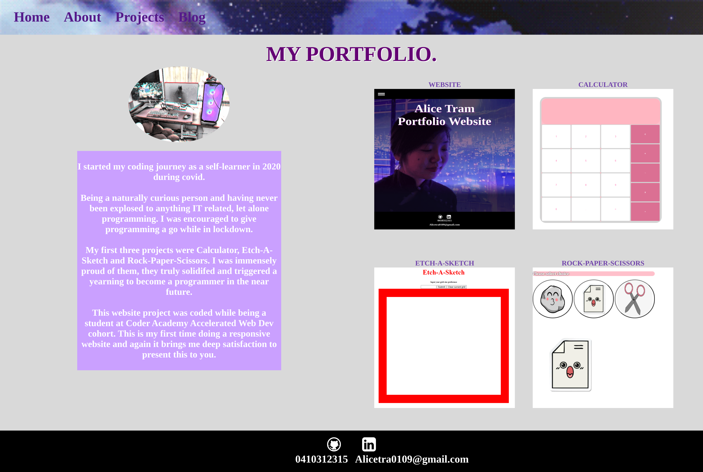
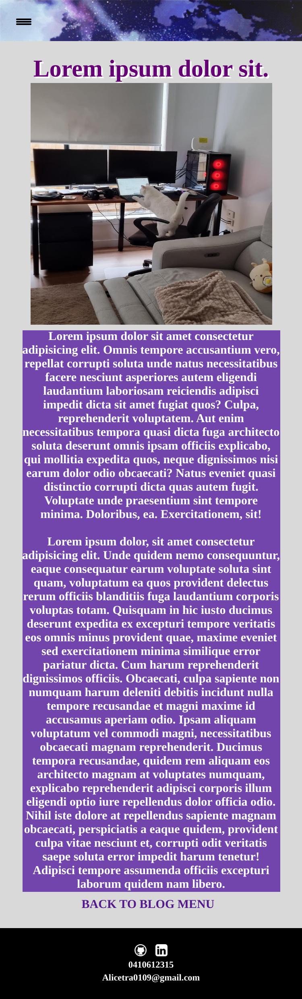

# T1A2 Portfolio Assigment
 
[Published Portfolio Website](https://website-portfolio-flax-kappa.vercel.app/?fbclid=IwAR3e1ND-44C76Af5vvEAG6DWgpaSnvpRcDbe-I7eM8gIIWpFqUQWHal9TT4)

[GitHub Repositority](https://github.com/alicetra/Website-Portfolio)

[Presentation Video](https://www.youtube.com/watch?v=LqbPjXm5obk)

# PURPOSE
Create an enticing website: one that displays not only my web development skills, but also reflects my personality.The core objective is to establish an online portfolio that offers glimpses into my skills, interests, professional knowledge, and work experience.It will also feature a showcase of my best work to demonstrate my capabilities to potential employers.

# FUNCTIONALITY & FEATURES

### Hamburger Navigation bar
The widely adopted hamburger navigation bar design element allows websites to maintain a neat, structured layout on smaller screens. As the window width decreases; the conventional navigation bar transforms into an icon shaped like a hamburger. Upon clicking this icon,it expands and displays the entire navigation menu.Therefore providing users with effortless access to all sections of the website.
By incorporating the hamburger navigation bar, I aimed to guarantee an intuitive user experience across all devices; additionally the position of this element is fixed ensuring it remains visible even if users need to scroll down.

### Responsive design 
Using the principle of flexbox, I thoughtfully designed this website for a fully responsive experience on desktops, laptops and mobile devices. This approach instills confidence that the website operates seamlessly across diverse device types; thus extending its accessibility to a wider audience.

### Integration of social media.
In the footer, this website actively integrates with popular social media platforms: LinkedIn and GitHub. Such integration not only fosters engagement; it also facilitates a comprehensive user experience,allowing users to delve into my work, establish professional connections with me, and remain up to date with my latest projects or professional advancements.

### Downloadable file.
The website presents a user-friendly option: simply click on the resume image or text to download my resume. This function proves exceptionally advantageous for mobile devices,which can lack plugins necessary for viewing embedded PDF files within browsers. 

### Consistent formatting 
Maintaining a consistent color theme with the use of purple hues ensures that users can navigate the website effortlessly. This consistency helps users to quickly identify and associate certain colors with specific elements,which in turn enhances their overall understanding of the website eg. all the headings are a certain shade of purple. 

consistent font styling ensures ease of readability and comprehension. It enhances the text's accessibility to a broader audience.

### Text and Image Spacing 
Image spacing plays an important role in enhancing the visual appeal of my website. Optimal gaps between images and written elements allow prevention of visual clutter.

Text spacing and break points  are crucial elements in enhancing a website's visual appeal and readability. When large blocks of text disintegrate into smaller, more manageable chunks; users can scan the content with greater ease,even digest it effectively. This practice significantly reduces eye strain and fatigue; consequently facilitating user engagement with the material at hand. A sense of balance and harmony on the page can also result from proper spacing between paragraphs and text; thus, enhancing its visual appeal.

### Font-size
Crafting a user-friendly web experience necessitates the essential element of maintaining readability in a website's font size across all media queries. It plays a vital role in ensuring that individuals with visual impairments or disabilities, who may require larger font sizes to browse the website at ease. As such I have chosen to employ VW units; this choice enables scalable and proportional adjustments,specifically, the font size adapts dynamically based on screen dimensions. 

### Contrasting coloring
This website uses contrasting shades of purples,a design technique that enhances the visual hierarchy and improves user experience; it highlights paragraphs, separates sections within an element on the page. 
This effective approach not only distinguishes different segments but also enables seamless navigation and comprehension of page content. 
Moreover, I deliberately chose to utilize a grey background instead of white: with the priority being user comfort. White backgrounds can pose eye strain; in contrast, the implementation of a softer visual experience through the use of grey enhances readability and significantly reduces this strain.

# SITEMAP
Internal navigation of the website 

# SCREENSHOTS
### Desktop/Laptop

### Mobile/Tablet

# TARGET AUDIENCE
The portfolio website is designed to appeal to employers seeking to engage a professional web developer. These employers possess technical knowledge in software development.

# TECH STACK
HTML

CSS

Vercel

